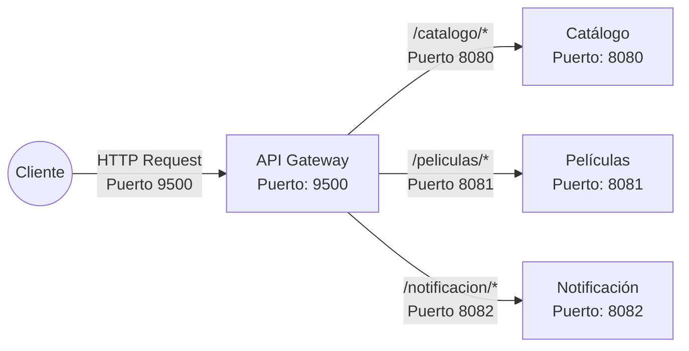

# API Gateway Videoclub

Este proyecto implementa un API Gateway basado en Spring Cloud Gateway para el sistema de microservicios Videoclub. Su función principal es enrutar las solicitudes HTTP hacia los microservicios internos, aplicar filtros y facilitar la gestión centralizada de rutas y seguridad.

## Requisitos previos
- Java 17 o superior
- Maven
- Docker (opcional, para despliegue en contenedores)

## Ejecución local
1. Clona el repositorio y navega al directorio del proyecto.
2. Compila y ejecuta con Maven:
   ```
   ./mvnw spring-boot:run
   ```
3. El gateway estará disponible en el puerto configurado (por defecto 9500).

## Ejecución con Docker
Puedes usar la imagen publicada en Docker Hub:
```
hmunoz79/apigateway:1.5
```

Ejemplo de configuración en `docker-compose.yml`:
```yaml
services:
  gateway:
    image: hmunoz79/apigateway:1.5
    extra_hosts:
      - "host.docker.internal:${HOST_IP}"
    ports:
      - "9500:9500"
    environment:
      SPRING_SERVER_PORT: 9500
      SPRING_CLOUD_GATEWAY_ROUTES[0]_URI: http://host.docker.internal:8080
      SPRING_CLOUD_GATEWAY_ROUTES[0]_ID: service-catalogo
      SPRING_CLOUD_GATEWAY_ROUTES[0]_PREDICATES[0]: Path= /catalogo/**
      SPRING_CLOUD_GATEWAY_ROUTES[0]_FILTERS[0]: StripPrefix=1
```

## Configuración de rutas
Las rutas del API Gateway pueden configurarse de dos maneras principales:

### 1. Configuración en `application.yaml` (ejecución local)
Si vas a ejecutar el proyecto localmente sin Docker, puedes definir las rutas directamente en el archivo `src/main/resources/application.yaml`:

```yaml
spring:
  cloud:
    gateway:
      routes:
        - id: service-catalogo
          uri: http://localhost:8080
          predicates:
            - Path=/catalogo/**
          filters:
            - StripPrefix=1
        - id: service-peliculas
          uri: http://localhost:8081
          predicates:
            - Path=/peliculas/**
          filters:
            - StripPrefix=1
        - id: service-notificacion
          uri: http://localhost:8082
          predicates:
            - Path=/notificacion/**
          filters:
            - StripPrefix=1
```

### 2. Configuración por variables de entorno (ejecución con Docker)
Si ejecutas el gateway en Docker, puedes definir las rutas usando variables de entorno en el archivo `docker-compose.yml`:

```yaml
services:
  gateway:
    environment:
      SPRING_CLOUD_GATEWAY_ROUTES[0]_ID: service-catalogo
      SPRING_CLOUD_GATEWAY_ROUTES[0]_URI: http://host.docker.internal:8080
      SPRING_CLOUD_GATEWAY_ROUTES[0]_PREDICATES[0]: Path=/catalogo/**
      SPRING_CLOUD_GATEWAY_ROUTES[0]_FILTERS[0]: StripPrefix=1
      # ...agrega más rutas incrementando el índice [n]...
```

**Recomendación:**
- Usa `application.yaml` para desarrollo local y pruebas rápidas.
- Usa variables de entorno para despliegues en Docker, entornos de integración o producción, donde la configuración debe ser dinámica y desacoplada del código fuente.

## Diagrama de flujo de tráfico

A continuación se muestra un diagrama en formato Mermaid que ilustra cómo el API Gateway enruta el tráfico hacia los microservicios principales del sistema Videoclub, indicando los puertos utilizados:



Este diagrama representa cómo las solicitudes del cliente llegan al API Gateway en el puerto 9500, que luego las deriva al microservicio correspondiente según la ruta y el puerto configurado.

## Recursos útiles
- [Documentación oficial Spring Cloud Gateway](https://docs.spring.io/spring-cloud-gateway/docs/current/reference/html/)
- [Repositorio de ejemplo](https://github.com/BarathArivazhagan/spring-cloud-gateway-routing)

## Notas
- El gateway está preparado para funcionar en entornos locales y de desarrollo, permitiendo la integración sencilla con otros microservicios.
- Para producción, revisa la configuración de seguridad y monitoreo.


## Imagen nativa
Para generar la imagen nativa se debe tener instalado GraalVM y configurado en el sistema. Luego se debe ejecutar el siguiente comando:
```shell
sdk use java 21.0.2-amzn
./mvnw spring-boot:build-image -Pnative
```